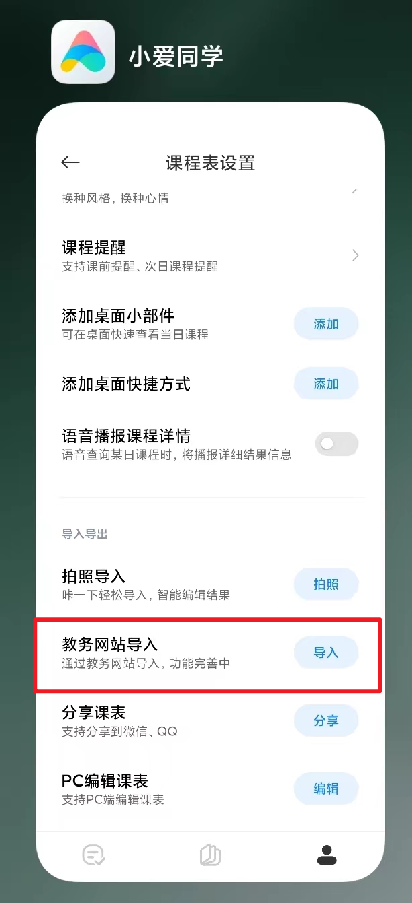

## 简介
* Author: 雨中人
* 安徽工程大学-人工智能222万世杰
* 开始时间: 2024-04-11 
* LastEditTime: 2024-07-7 21:57:50
* Description: 小爱课表适配安徽工程大学
* Version: 1.0.0
* QQ：2190638246
* https://github.com/wanshijie1

## 介绍
**校园内Xiaomi用户众多，小爱课表更是学生一大便利，但苦于小爱课表此前并未适配🍊，遂编写此适配器，惠及各位同学使用小爱课表。**

## 使用方法(一定要在校园网的环境下！)
**1. 呼出小爱同学打开课程表**
**2. 选择“教务网站导入”**

**3. 选择“安徽工程大学”**
**4. 进入这个页面说明已经成功一半了，登陆你的账号密码，若一直显示密码错误可以选择“从统一身份认证登陆”**

**从统一身份认证登陆：**

**5.导入成功后即可正常打开小爱课表查看你的课程信息，再也不用逐一手动录入**

## 注意事项
**1. 一定要在校园网环境下使用！！！，若在家，使用学校提供的VPN即可，否则加载不进去**
**2. 请选择相对应的校区，因为老校区和新校区上午课程时间不同，老校区7:40上课，新校区8:00上课**
**3. 若导入失败，联系作者，我来尝试完善程序**
